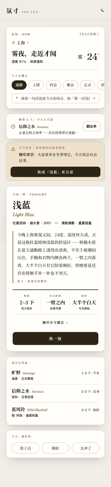
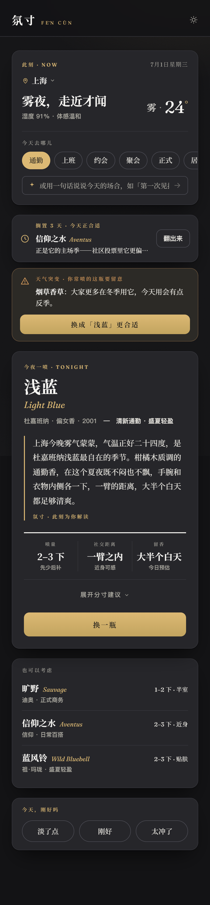
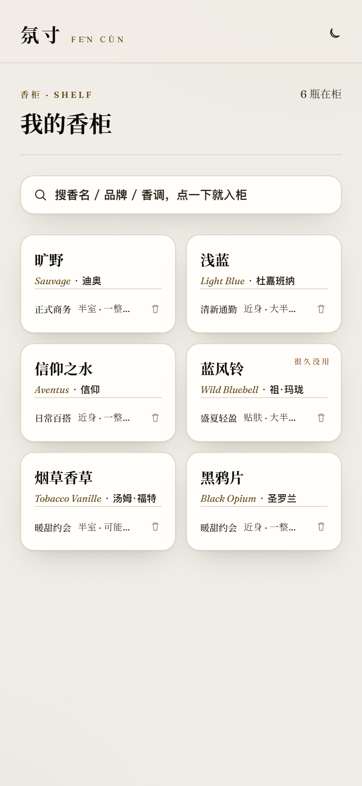
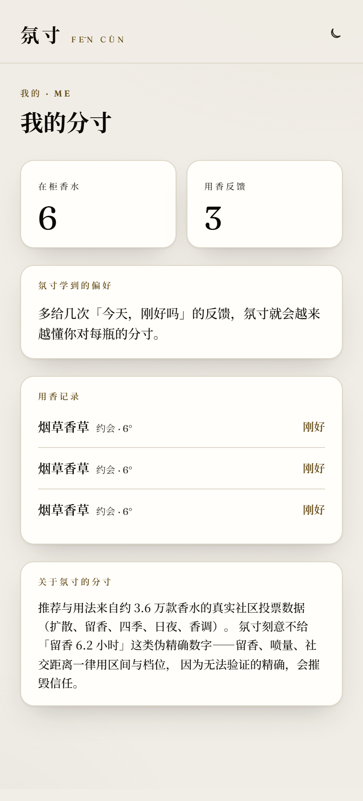
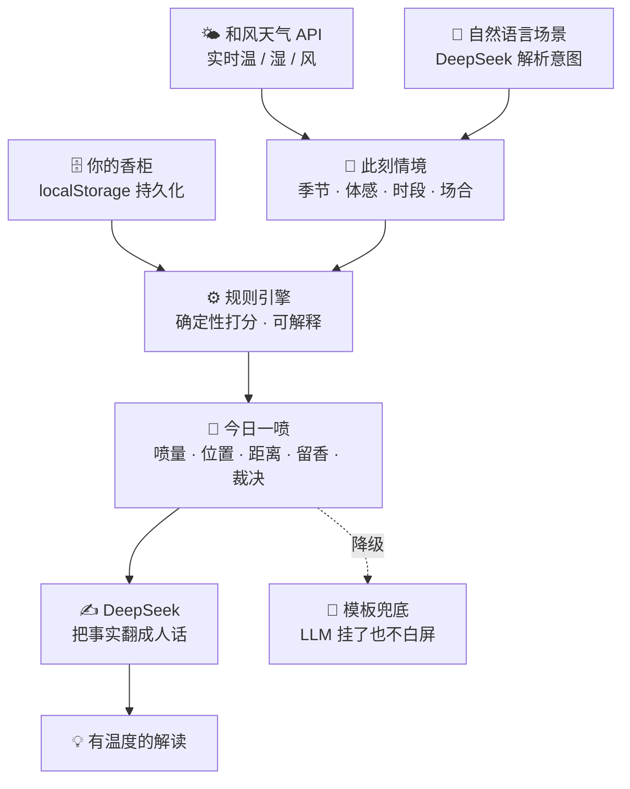

<div align="center">

# 氛寸 · Fēn Cùn

### 别人帮你**挑**香水，氛寸帮你**用好**香水。

一个基于实时情境的个人 **「用香决策」Agent**：<br/>
从你**已有**的香柜里，告诉你此刻——**喷哪瓶、喷多少、喷在哪、能留多久、要注意什么，以及为什么。**

<br/>

[](https://fencun.vercel.app)


<br/>

<table>
  <tr>
    <td align="center"><br/><sub><b>今日一喷 · 白天</b></sub></td>
    <td align="center"><br/><sub><b>今夜一喷 · 夜航</b></sub></td>
  </tr>
</table>

</div>

---

## 一句话

站在香柜前，你从不缺香水——缺的是「**今天到底用哪瓶、怎么用得恰到好处**」的那个判断。
氛寸不做导购、不做调香，只解决这一个每天真实发生的决策。

- **「今天喷哪瓶」** 是入口：你的香柜 × 此刻情境 → 最合适的一瓶，不认同可一键换成任意一瓶（用法即时重算）。
- **「这瓶怎么用」** 是灵魂：喷量档位 / 喷洒位置 / 社交距离 / 留香区间 / 风险提示，**全程不伪精确**——绝不给「留香 6.2 小时」这类无法验证的假数字。

> 完整产品方案见 [`docs/氛寸-产品方案.md`](docs/氛寸-产品方案.md)。

---

## 与「选香 / 导购」类产品有什么不同

| | 传统香水 App | **氛寸** |
|---|---|---|
| 解决的问题 | 买之前——**挑哪瓶** | 买之后——**今天用哪瓶、怎么用** |
| 输入 | 喜好、预算、评论 | **你已有的香柜 × 实时天气 × 场合** |
| 输出 | 种草、购买链接 | **可执行的用香建议 + 明确裁决 + 为什么** |
| 对待用户 | 尽量推荐、促成转化 | **不迁就**：真不合适就说「今天不建议这瓶」 |
| 精确度 | 「前调 30 分钟…」听感数字 | **只给区间与档位**，拒绝伪精确 |

---

## 核心能力

- 🎯 **今日一喷 + 怎么用** — 情境自动感知（和风天气定位温/湿/风/时段），从你库里打分推一瓶，附完整分寸建议。
- ⚖️ **不迁就的用香裁决** — `good / caution / avoid` 三档。天气大逆、严重反季、密闭场合遇张扬香 → 明确判 `avoid`，先说「不建议」，再教你若坚持该怎么补救。
- 💬 **自然语言场景** — 输入「去前任婚礼」「第一次见投资人」「想低调点」，DeepSeek 解析成 `场合 / 正式度 / 亲密度 / 规避项`，喂进打分与用法。
- 🔔 **发现型钩子** — 主动提醒，而非等你来问：
  - *天气突变预警*：你常喷的那瓶今天因天气/季节不合适 → 提示并给更优选。
  - *吃灰提醒*：搁置已久、但今天恰好合适的那瓶 → 「翻出来」。
- 🔁 **反馈闭环** — 出门归来答一句「今天，刚好吗？」，个人偏移**按瓶**收敛（嫌冲→下次少喷、嫌淡→多喷），越用越懂你的分寸。
- 🌗 **昼夜双主题** — 「香誌 / 夜航」设计语言：思源宋体做中文嗓音、Fraunces 配西文数字，白天宣纸暖白、夜晚中性炭黑 + 香槟金。

<div align="center">
<table>
  <tr>
    <td align="center"><br/><sub><b>香柜 · 搜名秒加 / 吃灰标记</b></sub></td>
    <td align="center"><br/><sub><b>我的分寸 · 偏好画像 / 用香记录</b></sub></td>
  </tr>
</table>
</div>

---

## 它怎么想

**决策权在规则引擎，表达权在 LLM。** 匹配打分、喷量/距离/留香判定全部由确定性规则计算（可解释、可复现、可单测）；DeepSeek 只做两件事——听懂自然语言场景、把规则算好的事实翻译成有温度的人话。**天气永远来自和风天气 API，绝不让 LLM 编造。** 即便 DeepSeek 超时，规则引擎照样出推荐与模板用法，产品不白屏。



### 打分公式（`src/lib/scoring.ts`）

```text
score =  ( 0.38·季节匹配 + 0.19·时段匹配 + 0.43·场合贴合 )   ← 线性主项，权重归一
       ×  天气乘子 W   ∈ [0.7, 1.3]                          ← 闷热压厚重、寒冷奖暖香
       ×  质量微调 Q   ∈ [0.96, 1.04]                        ← 社区口碑只作轻推，不替你挑瓶
       ×  个人偏移 biasMul                                    ← 你的反馈，按瓶收敛
       ×  场景规避 avoidPenalty                               ← 「别太甜 / 别太冲」硬降权
```

> 场合权重刻意略高于季节——**「今天去哪儿」比「现在什么季」更该决定喷哪瓶**（急性温度由乘性 W 兜底）。质量先验被压成 ±4% 的轻推，避免高分香跨场景通吃。

---

## 四条戒律（继续开发必须守）

1. **不伪精确** — 留香 / 喷量 / 社交距离只给区间与档位，绝不给「6.2 小时」这类无法验证的假数字。
2. **不过度设计** — 不上向量库；规则引擎在浏览器本地毫秒出结果，零延迟零成本。
3. **轻冷启动** — 搜名秒加建香柜，不逼用户先填一堆问卷。
4. **有反馈闭环** — 每次推荐都能被评价、被修正，个人偏移持续收敛。

---

## 技术栈

| 层 | 选型 | 说明 |
|---|---|---|
| 框架 | **Next.js 16**（App Router）+ **React 19** + **TypeScript 5** | 一仓库承载前端与轻后端 |
| 后端 | **Route Handlers** | 代理和风/DeepSeek，保护 key + 缓存 + 限流 + 降级 |
| 样式 | **Tailwind v4**（CSS-first `@theme` token，无 UI 库） | 昼夜双主题、自持字体 |
| 决策 | **确定性规则引擎**（纯 TS） | 前端本地打分，可解释可单测 |
| 检索 | **MiniSearch 7**（自定义中英文分词） | 搜名 / 品牌 / 香调秒加 |
| 状态 | **Zustand 5** + localStorage | 香柜与反馈持久化，接口已抽象可换 Supabase |
| 语义 | **DeepSeek API** | 场景解析（`json_object`）+ 自然语言解读 |
| 天气 | **和风天气 QWeather** | 服务端调用 + 30 分钟网格缓存 |
| 校验 / 部署 | **zod** · **Vercel** | 入参校验、GitHub 自动部署 |

---

## 数据

香水数据来自 **ledecanteur**（Fragrantica 社区数据），含真实社区投票：扩散 sillage(1–4)、留香 longevity(1–5)、四季 / 日夜投票、带强度香调、前中后调。

- 原始 13.2 万款 → 按投票数 ≥ 50 筛得约 **3.67 万款**。
- MVP 精选**热度 Top 1500 款**，构建期预计算季节平滑占比、日夜占比、扩散四档、风格标签。
- **中文化**：香调 / 品牌 / 气味词 **100%**，香名 **89%**（保守映射官方名/香圈绰号/忠实直译，无可靠中文名者诚实回退英文）。
- 原始数据不入仓库，仅提交裁剪后的静态 JSON（`public/data/perfumes.min.json`，1.6 MB / gzip ≈ 261 KB，Vercel 以 brotli 传输 ≈ 162 KB）。

---

## 本地运行

```bash
npm install

# 环境变量：复制以下内容到 .env.local（已被 git 忽略）
cat > .env.local <<'ENV'
QWEATHER_HOST=你的和风天气-API-HOST
QWEATHER_KEY=你的和风天气-KEY
DEEPSEEK_API_KEY=你的-DeepSeek-key
DEEPSEEK_BASE_URL=https://api.deepseek.com
ENV

npm run dev            # http://localhost:3000
```

数据管线（可选，仓库已含构建产物）：

```bash
npm run extract:terms  # 从本地 ledecanteur/ 流式抽取精选子集与词表
npm run build:data     # 应用中文映射 + 预计算 → public/data/perfumes.min.json
```

---

## 目录结构

```text
src/
  app/                  今日 / 香柜(library) / 我的(profile) 三页 + API 路由
    api/context/        和风天气代理（保护 key + 网格缓存 + 降级）
    api/explain/        DeepSeek 解读（只翻译规则事实，失败降级模板）
    api/parse-intent/   DeepSeek 场景解析（zod 校验，降级关键词启发式）
  components/            AppProvider / 推荐卡 / 天气卡 / 发现型钩子 / 搜索添加 …
  lib/                  types · scoring(打分) · usage(用法) · recommend(编排)
                        · season · hooks · store · ratelimit
scripts/                零依赖数据构建管线 + 截图脚本
data/zh-map/            英文→中文映射（accords / notes / brands / names）
docs/                   产品方案 · 审查文档 · 截图
```

---

<div align="center">

**氛寸** —— 让每一瓶香，都用在它最好的那一刻。

[在线体验](https://fencun.vercel.app) · [产品方案](docs/氛寸-产品方案.md)

</div>
