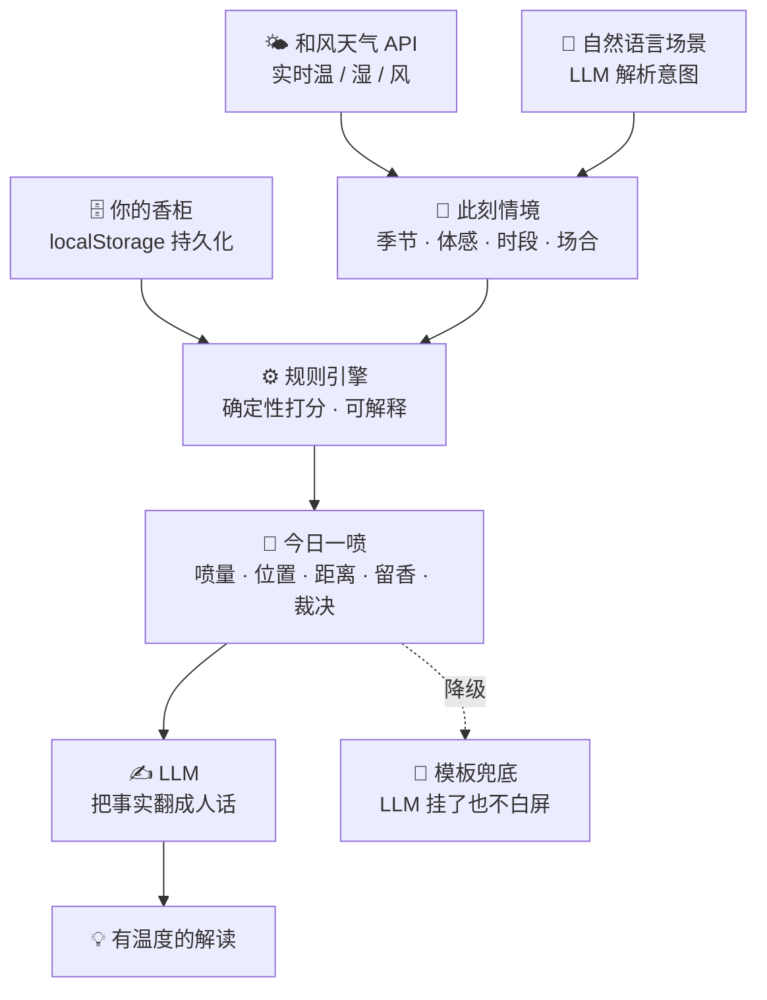

<div align="center">

# 氛寸 · Fēn Cùn

### 从香柜前的那三秒说起

**氛=无形的氛围，寸=有形的尺度。** 一个基于实时情境的个人「用香决策」Agent——
不帮你**挑**香水，帮你**用好**你已经拥有的香水。

[](https://fencun.vercel.app)
&nbsp;
[](../README.md)

<table>
  <tr>
    <td align="center"><br/><sub><b>今日一喷 · 白天</b></sub></td>
    <td align="center"><br/><sub><b>今夜一喷 · 夜航</b></sub></td>
  </tr>
</table>

</div>

---

你站在香柜前。八瓶香水，今天穿深色、要见客户、外面 30℃ 闷。

你不缺香水——你缺的是那句判断：**今天到底该喷哪瓶、喷几下、会不会在会议室里太张扬。**
大多数人的解法是「无脑喷那瓶老相好」。于是另外七瓶常年吃灰，而那瓶老相好，在盛夏正午和冬夜地铁里其实是两种完全不同的东西。

氛寸接手的，就是这三秒。

> **想快速各取所需**：想知道「它对我有啥用」→ 读第 **二 / 四 / 五** 章；想看「技术怎么实现」→ 读第 **三 / 六 / 八** 章。

---

## TL;DR

| | |
|---|---|
| **一句话** | 你已经有这些香水，氛寸帮你决定此刻该喷哪一瓶、怎么喷得恰到好处。 |
| **和别的香水产品差在哪** | 别的都在帮你**买下一瓶**；氛寸只帮你**把手里的用好**。 |
| **为谁** | 已拥有 ≥3 瓶香水、常「喷错 / 喷多 / 喷得没存在感 / 不知道今天用哪瓶」的人。 |
| **形态** | 响应式 Web（今日 / 香柜 / 我的三页），已上线 [fencun.vercel.app](https://fencun.vercel.app)。 |

---

## 一 · 为什么做这个

香水的意义不在「拥有多少」，而在「此刻用得对不对」。
同一瓶佛手柑，在 35℃ 盛夏正午和零度深夜地铁里，是两种香水。决定它好不好的，从来不是它本身，而是它与天气、体感、场合、与你今天想成为谁之间的关系。

而国内香水产品都停在「**买**」这一侧：香水时代做香评百科，嗅氪做 AI 调香，电商做种草导购。可是**买只发生一次，用发生每一天**——没有人接手「你已经有的这些香水，今天怎么用」。

氛寸相信：香水是**使用**的艺术，而非收藏的军备竞赛。

| 它反对的旧观念 | 氛寸的主张 |
|---|---|
| 越浓越高级 | 扩散有边界，过浓是失礼；高级是「刚好被闻到」 |
| 越多越好，不停买更贵的 | 你已拥有的大多没用对，先把手里的用到位 |
| 香水是「买」的学问 | 香水是「用」的学问——买一次，用每天 |

**品牌内核是「分寸感」**，三重同一：

- **气味的分寸**——喷多少、喷在哪、扩散几米。
- **场合的分寸**——配不配得上此刻的你、这个房间、这些人。
- **表达的分寸**——香水是你今天无声说出的第一句话。

---

## 二 · 它做什么

氛寸有三层能力，缺一层就退化成又一个「选香工具」：

1. **推荐** — 你的香柜 × 此刻情境 → 最适合的一瓶。
2. **可换** — 一键换成你想喷的任意一瓶，决策权永远在你手里，用法即时重算。（没有「可换」，推荐就成了强加。）
3. **教你怎么用**（核心）— 喷几下、喷在哪、社交距离、留香区间、合不合时宜、有无风险、以及**为什么**。（没有这一层，前两层就退化成选香工具。）

它**不是**：不是导购电商（不挂商城、不种草，你来时已拥有香水）；不是香评社区（香水时代已做好）；不是 AI 调香（那是嗅氪的方向）；不是带一堆滑块的查询工具（情境自动感知，输出是「懂的人会对你说的话」）。

### 六个真实场景

> 下表文案为示意，用以说明氛寸的**说话口吻与介入时机**；真实界面见上方截图（那句「喷 2 下、别上身、走近才闻到」就是今日推荐卡的实际样子）。

| 场景 | 氛寸介入 | 它会说 |
|---|---|---|
| 早间通勤前 | 打开即见今日推荐 | 「今天上海 28℃、湿度 80%、闷。从你库里选**蓝风铃**：清爽柑橘扛这种黏腻天。喷 2 下（手腕＋颈侧），别上身。今天它属于『走近才闻到』的距离。」 |
| 重要场合临时确认 | 输入场景「见客户」 | 「你选的**信仰之水**在商务场偏稳。但今天室内空调密闭，建议只喷 1 下、喷衣领内侧。」 |
| 换香后不确定 | 一键换香 | 「换成**烟草香草**没问题。它扩散偏外放、偏甜偏厚，今天 30℃ 建议减到 1 下、只喷手腕。」 |
| 🚩 **天气突变预警** | 情境刷新自动提示 | 「今天骤降到 12℃ 还下雨——你常喷的清新柑橘会被压住、留不住。库里**香料炸弹**更扛冷湿天，要不要换？」 |
| 🚩 **吃灰提醒** | 合适情境顶出冷落瓶 | 「这瓶你 35 天没碰了——今天干冷的天正是它的主场，翻出来？」 |
| 用后复盘 | 晚间轻问一句 | 「今天那瓶，刚好吗？〔淡了点 / 刚好 / 太冲了〕」——一次点击，收敛明日推荐。 |

> 🚩 标记的两个是**发现型钩子**，也是氛寸真正的价值重心。「今天喷哪瓶」其实是弱痛点——你无脑喷老相好也不痛苦。**真正让人「咦一下」的，是它替你发现了你没意识到的问题**：那瓶好香在吃灰、那瓶常喷的今天会翻车。产品价值押在这里，而非假装「选香焦虑」是刚需。

<div align="center"><sub><b>👉 想看看你自己的香水今天会不会翻车？<a href="https://fencun.vercel.app">打开 fencun.vercel.app 试试</a></b></sub></div>

---

## 三 · 它怎么想（工程内核）

> 只关心「它对我有啥用」的读者可以跳到 [第四章](#四--不迁就--用香裁决)——下面是给工程视角的人看的。

一句话架构：**决策权在规则引擎，表达权在 LLM。**

匹配打分、喷量 / 距离 / 留香判定，全部由**确定性规则**计算——可解释、可复现、可单测。
LLM 只做两件事：**听懂**自然语言场景、把规则算好的事实**翻译**成有温度的人话。
**天气永远来自和风天气 API，绝不让 LLM 编造。** 即便 LLM 超时，规则引擎照样出推荐与模板用法，产品不白屏。



| 任务 | 谁做 | 为什么 |
|---|---|---|
| 匹配打分、排序 | **规则引擎** | LLM 打分不可复现、不可审计；规则每一分都能拆给用户看 |
| 喷量 / 部位 / 距离 / 风险 | **规则引擎** | 这是壁垒，交给 LLM 会幻觉出「喷膝盖后侧 3 下」 |
| 自然语言 → 结构化情境 | **LLM** | 规则穷举不了「去前任婚礼」「第一次见投资人」，正是 LLM 所长 |
| 把结果翻成有温度的解释 | **LLM** | 让它像「懂香水的朋友」；但解释必须基于规则给定的事实，不准改结论 |

### 打分引擎（`src/lib/scoring.ts`）

真实社区投票占比做基底，实时天气做乘性校准，所有对外表达都是区间 / 档位 / 人话——绝不输出可被证伪的精确数字。

```text
score =  ( 0.38·季节匹配 + 0.19·时段匹配 + 0.43·场合贴合 )   ← 线性主项，权重归一
       ×  天气乘子 W   ∈ [0.7, 1.3]                          ← 闷热压厚重、寒冷奖暖香
       ×  质量微调 Q   ∈ [0.96, 1.04]                        ← 社区口碑只作轻推
       ×  个人偏移 biasMul                                    ← 你的反馈，按瓶收敛
       ×  场景规避 avoidPenalty                               ← 「别太甜 / 别太冲」硬降权
```

「规则每一分都能拆给用户看」不是口号。以场合贴合分（`occasionFit`）为例，它按**真实香调家族**判定：

- **约会 / social**：甜、花最讨喜（加分）；泥土、木质、辛辣不浪漫（减分）；纯清冽也不够暧昧（略减）。
- **正式 / 通勤**：干净木质、柑橘、草本得体（加分）；反甜、反花、反脏气（减分）；扩散第四档（张扬）在密闭场合再减。
- **运动**：清新、水生加分；甜、重、木质强烈减分。

两个刻意的设计判断，都由真实数据诊断驱动：

- **场合权重（0.43）略高于季节（0.38）**——「今天去哪儿」比「现在什么季」更该决定喷哪瓶；急性温度已由乘性 W 兜底。
- **质量先验压成 ±4%（0.96–1.04）**——曾出现「不管什么场景都推同一瓶」：诊断发现是社区高分香靠 Q 跨场景通吃（某用户库里一瓶占了 53% 的场景格）。把 Q 压成轻推后，同一柜子里由场景 / 季节 / 天气决定今天喷哪瓶，而非社区评分替你决定——那瓶降到 43%，四瓶明显轮换起来（反季安全经合成检验兜底）。

> 季节判定不只看月份——日期 × 实时气温共同确定；喷量按 sillage 四档起步、再按密闭 / 开阔场景 ±1 档；社交距离直接绑 sillage 的四个投票档位（贴肤 / 一臂 / 一桌 / 满室），不假装两位小数分辨率。

### 四条戒律

1. **不伪精确** — 留香 / 喷量 / 距离只给区间与档位，绝不给「6.2 小时」这类无法验证的假数字。无法验证的精确，会摧毁信任。
2. **不过度设计** — 不上向量库；规则引擎在浏览器本地毫秒出结果，零延迟零成本。何时才需要向量库？从「库内决策」扩展到「全库语义发现」时——在那之前一行都不写。
3. **轻冷启动** — 搜名秒加建香柜，不逼用户先填问卷。
4. **有反馈闭环** — 每次推荐都能被评价、被修正，个人偏移持续收敛。

---

## 四 · 不迁就 · 用香裁决

好的建议不能只会讨好。氛寸对每次推荐给一个明确裁决 `good / caution / avoid`：

- 天气大逆、严重反季、密闭场合遇张扬香 → 判 **`avoid`**，先说「今天不太建议用这瓶」，**再转折教你若坚持该怎么补救**（减到 1 下、喷衣内侧……）。
- LLM 的解读被规则约束：裁决为 `avoid` 时，它不准把话圆回「其实也挺合适」。

> 一个真会替你踩刹车的助手，比一个永远说「都很棒」的助手可信得多。这是「分寸感」在产品性格上的落地。

---

## 五 · 越用越懂你 · 反馈闭环

出门归来，答一句「今天，刚好吗？」——`淡了点 / 刚好 / 太冲了`。

这条反馈**按瓶**聚合成个人偏移，喂回用法计算：多次嫌冲 → 下次帮你少喷；嫌淡 → 多喷。
关键克制：反馈只对「你的这瓶」做个人化偏移，不污染全局社区投票——它是「这瓶怎么用」长期个人化的数据来源，而不是又一个被平均掉的评分。

<div align="center">
<table>
  <tr>
    <td align="center"><br/><sub><b>香柜 · 搜名秒加 / 吃灰标记</b></sub></td>
    <td align="center"><br/><sub><b>我的分寸 · 偏好画像 / 用香记录</b></sub></td>
  </tr>
</table>
</div>

> 回访留存押在两个慢变量：**情境每天真实在变**（天气驱动，保证「每天不一样」）＋ **系统越用越懂我**（反馈驱动，保证「越来越准」）。缺一个，就退化成小玩具。

<div align="center"><sub><b>👉 <a href="https://fencun.vercel.app">建个香柜，看它两天后会不会更懂你</a></b></sub></div>

---

## 六 · 数据

一句话结论：**氛寸的每条建议都来自真人使用反馈，而非厂商宣称。** 厂商说「持久 8 小时」不可信，三千人投票的均值可信。

数据来自 **ledecanteur**（Fragrantica 社区数据），longevity / sillage / seasons / daypart 全是社区**投票计数**——「这瓶夏天合不合适」不是编辑拍脑袋，而是有多少人投了夏天。

- 原始 **13.2 万款** → 按投票数 ≥ 50 筛得约 **3.67 万款**。
- MVP 精选**热度 Top 1500 款**（中国用户真会拥有的），构建期预计算季节拉普拉斯平滑占比、日夜占比、扩散四档、风格标签。
- **中文化是体验生死线**：香调 / 品牌 / 气味词 **100%**，香名 **89%**（保守映射官方名 / 香圈绰号 / 忠实直译；无可靠中文名者诚实回退英文——错的中文名比英文更糟）。
- 原始数据（636 MB）不入仓库，只提交裁剪后的静态 JSON（`public/data/perfumes.min.json`，1.6 MB / gzip ≈ 261 KB，Vercel 实际以 brotli 传输 ≈ 162 KB），浏览器本地毫秒检索与打分。

<sub>数据口径注：原始 `vote_count` 与 `people` 是两列、约 1.1 万行不相等，按不同列筛得 36,705 / 36,648，已逐列核对。香名 89%（1335/1500）按「有中文名条目」计，其中约 13 款是无中文对应、诚实保留的数字 / 字母原名（如「1888」「乌龙茶 X」）。</sub>

---

## 七 · 设计语言 · 香誌 / 夜航

设计目标：精致、简约、高级、可信——像「懂香水、懂场景、懂表达」的智能体，而非查询工具。

- **双嗓音排版**：中文用**思源宋体 Noto Serif SC**（手账感、差异化），西文与数字用 **Fraunces** 衬线，自持字体、按需子集。
- **昼夜双主题**：白天宣纸暖白、高对比近黑；夜晚中性炭黑 + 暖奶白 + 香槟金点缀。手动切换并记忆。
- **可信化表达**：香调 0–100 渲染为横向证据条、季节匹配点、扩散四档——所有条一次性增长不循环跳动；留香给「大半个白天」不给「6.2 小时」。
- **克制动效**：只在卡片入场、证据条增长、换瓶重排三处用，禁循环 / 视差 / 弹跳。
- **品牌化术语**：香柜 · 今日一喷 · 换一瓶 · 分寸建议 · 「今天，刚好吗？」· 此刻 · 气味档案。

---

## 八 · 技术栈

| 层 | 选型 | 说明 |
|---|---|---|
| 框架 | **Next.js 16**（App Router）+ **React 19** + **TypeScript 5** | 一仓库承载前端与轻后端 |
| 后端 | **Route Handlers** | 代理和风 / DeepSeek，保护 key + 缓存 + 限流 + 降级 |
| 样式 | **Tailwind v4**（CSS-first `@theme` token，**无 UI 组件库**） | 昼夜双主题、自持字体，源码级可控 |
| 决策 | **确定性规则引擎**（纯 TS，前端本地） | 可解释、可复现、可单测；零延迟零成本 |
| 检索 | **MiniSearch 7**（自定义中英文分词） | 搜名 / 品牌 / 香调秒加 |
| 状态 | **Zustand 5** + localStorage | 香柜与反馈持久化，`Storage` 接口已抽象，可平滑换 Supabase |
| 语义 | **DeepSeek**（`deepseek-v4-flash`，最新模型） | 场景解析（`json_object` + zod 校验）+ 自然语言解读；模型经 `DEEPSEEK_MODEL` 可配 |
| 天气 | **和风天气 QWeather** | 服务端调用 + 30 分钟网格缓存，失败退化「仅季节 + 时段」仍可推荐 |
| 部署 | **Vercel** | GitHub 自动部署 |

**工程分层原则**：重计算（打分）在前端本地，重 key / 隐私（天气、LLM）在服务端，重数据在构建期固化成静态 CDN 资产——三者不混。

---

## 九 · 我为什么这样选（产品判断）

作品集的价值不在功能多，而在每一处克制背后都有判断。

- **不上向量库** — 当前全是结构化字段的数值比较，规则引擎直接算。上向量库是「PPT 复杂度」，不是需求。
- **不做「按用户拟合的在线模型」** — 冷启动阶段每用户样本量只有 O(数十)，摊到 8 瓶 × 4 天气 × 5 场景，任何拟合（协同过滤、在线回归都一样）都是过拟合。改成「**全局规则 + 个人硬偏移**」：你说 3 次太冲，就对你这瓶直接降一档——简单、当场可感、不需大数据。拟合类方案是数据攒够后的远期选项，不是 MVP 依赖。
- **不追全量数据** — 用「小而全中文」换「大而露英文」，直接拆掉自己定的生死线；搜不到的长尾，老实让用户手动记名字。
- **不伪精确** — 敢于不精确本身就是产品判断。

### 关于竞争与壁垒（诚实版）

有人会问：香水时代两周就能抄「今天喷哪瓶」，壁垒在哪？

诚实地说，**形态没有护城河**——任何独立开发者一个周末也能做个类似的小工具。氛寸真正押的是两件事：

1. **在位者的动机错配窗口期**。香水时代、电商这类在位者，KPI 与货架逻辑都指向「卖下一瓶」，「帮你把已有的用好」是它们**看不上的低优先级长尾**——不是做不了，是没动力做。我赌的是它们看不上，为自己争取先发的心智窗口。
2. **随时间加深的个人化数据**。「按瓶个人偏移」越用越准，是抄形态抄不走的东西——这是慢变量，得靠时间和真实反馈长出来。

把这两点讲清楚，比硬说「别人结构上不可能做」更经得起追问。

---

## 十 · 边界与诚实

- **高频基本盘其实窄**：真正每天打开的只有「纠结的轮换者」；「场合敏感者」是事件触发的低频口碑放大器，「钻研型爱好者」是专业背书与优质反馈的少数派。不假装全员高频。
- **需求敢被证伪**：内建两个证伪指标——**换香率**与**吃灰瓶采纳率**。若用户从不换、永远喷第一瓶，说明没创造增量决策价值。
- **数据目前全在本地**：无账号体系，localStorage 持久化，因此暂无跨端同步。迁 Supabase 时走「设备匿名 id 先行、后接账号」路径，`Storage` 接口已抽象、业务层零改动。
- **刻意暂不做**：UGC 社区、商城 / 种草变现、穿搭图像识别——不在闭环主线上的一律后置。

---

## 十一 · 路线图

**已上线**：三页闭环 · 搜名秒加 · 规则推荐 + 用法 · 一键换香 · 用香裁决 · 三档反馈→个人偏移 · 自然语言场景输入 · 天气突变预警 + 吃灰提醒 · 昼夜双主题 · 偏好画像 · API 限流与全链路降级。

**下一步**：香名中文化冲 95%＋ · 反馈飞轮扩到多维画像（怕甜 / 怕冲 / 某调性敏感）· 香柜资产化（用香日历、季节轮换报告）· 扩到全量数据并迁 Supabase。

**长期变现（守住非导购）**：卖「分寸」本身——订阅高级版（更细的个人香水画像、年度用香回顾、季节轮换指南），不碰交易、不种草。

---

<div align="center">

### 一分钟记住氛寸

**「我做的不是香水导购，是香水的天气预报。」**<br/>
每天清晨，基于真实天气体感，从你已有的香水里告诉你今天喷哪瓶、喷多少。

**「国内所有香水产品都停在『买』，我做了『买之后』。」**<br/>
别的产品都想让你买更多，氛寸只想让你把手里的用好。

**「约 3.6 万款真实社区投票 × 实时天气 × LLM，做成一个有分寸感的智能体——且刻意不伪精确。」**<br/>
无法验证的精确会摧毁信任，所以留香只给区间、社交距离只给档位。

<br/>

**氛寸** —— 让每一瓶香，都用在它最好的那一刻。

[在线体验](https://fencun.vercel.app) · [工程概览 README](../README.md)

</div>
